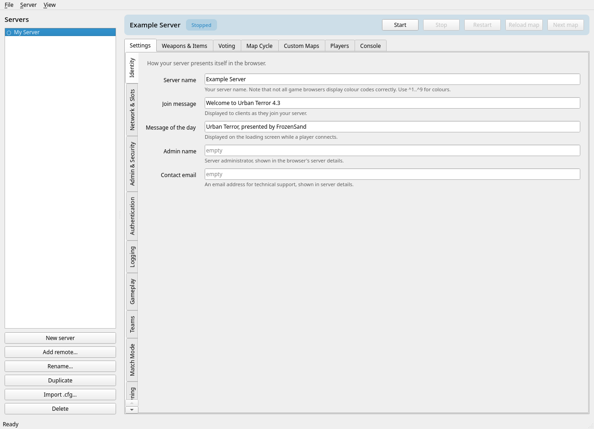
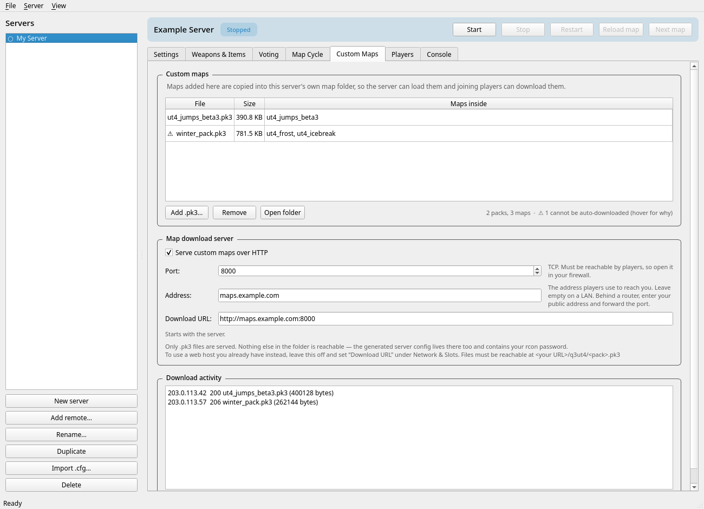

# Urban Terror Server Manager

[](https://github.com/Gnafu86/urbanterror-server-manager/actions/workflows/ci.yml)
[](https://github.com/Gnafu86/urbanterror-server-manager/actions/workflows/release.yml)
[](https://www.python.org/)
[](#installation)
[](LICENSE)

A desktop application for configuring, launching and administering Urban
Terror 4.3 dedicated servers. All server variables are exposed through the
interface, removing the need to edit `server.cfg` by hand or to compute the
`g_gear` letter set and `g_allowvote` bitmask manually.



---

## Contents

- [Features](#features)
- [Requirements](#requirements)
- [Installation](#installation)
- [Usage](#usage)
- [Architecture](#architecture)
- [Development](#development)
- [Reference data](#reference-data)
- [Project layout](#project-layout)
- [License](#license)

---

## Features

| Area | Description |
| --- | --- |
| **Server configuration** | Approximately 130 server variables presented as form controls, grouped into Identity, Network & Slots, Admin & Security, Authentication, Logging, Gameplay, Teams and Match Mode. |
| **Gametype awareness** | Mode-specific pages are shown or hidden according to `g_gametype`, so only the settings relevant to the active mode are displayed. |
| **Latched variables** | Variables the engine applies only on map reload are labelled accordingly, so pending changes are not mistaken for applied ones. |
| **Weapons and items** | `g_gear` is edited as a grid of weapons and equipment. The raw value remains visible and editable. |
| **Voting** | `g_allowvote` is edited as a checklist of the 30 available votes. Votes that grant broad server control are identified separately. |
| **Map rotation** | The map cycle is assembled from the maps actually present, determined by scanning the installed `.pk3` archives. |
| **Custom maps** | Per-server `.pk3` management, with an optional built-in HTTP server that supplies them to connecting clients. |
| **Process control** | Start, stop and restart, plus map reload and cycle. Changes to non-latched variables are applied to a running server immediately. |
| **Console** | The server console, with command history and tab completion over the engine and gamecode command sets. |
| **Player administration** | Live player list with kick, ban, mute, slap, nuke, smite and team assignment. |
| **Remote servers** | Servers on other hosts can be configured and administered over rcon. |

### Custom map distribution

Map packs added to a server are copied into that server's own map directory,
which serves two purposes: the game server loads maps from it, and the download
server publishes them from the same location.

Enabling **Serve custom maps over HTTP** starts a local web server and sets
`sv_dlURL` accordingly. It starts and stops together with the game server, and
records each download.

| Deployment | Configuration |
| --- | --- |
| Local network | Leave the address field empty; the local address is detected automatically. |
| Behind NAT | Enter the public address and forward the TCP port. |
| External web host | Disable the built-in server and set **Download URL** under Network & Slots. Files must be reachable at `<url>/q3ut4/<pack>.pk3`. |

> [!IMPORTANT]
> The download server publishes `.pk3` files exclusively. The same directory
> contains the generated server configuration, which holds the rcon password in
> plain text. Directory traversal is rejected and directory listings are not
> produced.



---

## Requirements

| Component | Requirement |
| --- | --- |
| Python | 3.10 or later (source installation only) |
| Qt bindings | PySide6 (source installation only) |
| Game | Urban Terror 4.3 including a dedicated server binary |

No further dependencies are required; all remaining functionality uses the
Python standard library.

---

## Installation

### Prebuilt binaries

Download the appropriate file from the
[latest release](https://github.com/Gnafu86/urbanterror-server-manager/releases/latest).
Both bundle Python and Qt and require no separate installation.

| Platform | File | Procedure |
| --- | --- | --- |
| Linux | `UrbanTerrorServerManager-x86_64.AppImage` | Mark executable with `chmod +x`, then run |
| Windows | `UrbanTerrorServerManager.exe` | Run directly |

Windows SmartScreen reports unsigned executables as unrecognised. Select
**More info → Run anyway**, or build from source.

### From source

Install PySide6 using the appropriate method for the platform:

```bash
sudo pacman -S pyside6
```

```bash
sudo apt install python3-pyside6
```

```bash
pip install --user PySide6
```

Then run the application:

```bash
python3 run.py
```

A desktop entry may be installed with:

```bash
./install.sh
```

---

## Usage

The game installation is located automatically in the standard directories
(`/opt/urbanterror`, `/usr/share/urbanterror`, `C:\Program Files\UrbanTerror`
and others), including by resolving an `urbanterror-server` wrapper on `PATH`.
If the installation resides elsewhere, the directory is requested once and
retained.

Servers are defined as profiles listed in the sidebar. Each profile holds a
complete configuration and may be started independently. Profiles can be
duplicated, renamed and exported, and an existing `server.cfg` can be imported.

---

## Architecture

### Process model

Servers run as child processes of the manager and therefore stop when the
manager exits; confirmation is requested beforehand. The server console is the
child process's own standard input and output, which means a locally launched
server requires no rcon password in order to be administered.

### File locations

Each profile is allocated a dedicated `fs_homepath`, containing its generated
configuration, map cycle, logs, demos and custom maps.

| Item | Linux | Windows |
| --- | --- | --- |
| Profiles | `~/.config/utsm/profiles.json` | `%APPDATA%\UrbanTerrorServerManager` |
| Server data | `~/.local/share/utsm/profiles/<id>/` | `%LOCALAPPDATA%\UrbanTerrorServerManager` |

The game installation is never modified. On packaged Linux distributions it is
owned by root and read-only, and the engine searches the home path before the
base path, so generated configuration is found without elevated privileges.
Multiple servers may therefore run concurrently without sharing a log file or
map cycle.

### Configuration model

Profiles are stored as JSON and the server configuration file is generated from
a profile at launch. Importing an existing `server.cfg` preserves any directive
the application does not model, and such directives continue to be written to
the generated configuration.

---

## Development

Run the test suite:

```bash
python3 -m pytest tests/ -q
```

The suite starts genuine dedicated servers on ports 27965–27990 to verify that
generated configuration is honoured, that the process lifecycle leaves no
orphaned processes, and that rcon and the download server behave correctly.
Tests requiring a game installation are skipped automatically when none is
present, which is the case in continuous integration.

| Workflow | Trigger | Purpose |
| --- | --- | --- |
| `ci.yml` | Push, pull request | Test on Linux and Windows against Python 3.10 and 3.12 |
| `release.yml` | Tag matching `v*` | Build the AppImage and Windows executable and publish a release |

Adding a server variable requires a single entry in `utsm/model/cvars.py`. The
interface is generated from that registry, and a test asserts that every
registered variable has a corresponding control.

---

## Reference data

The canonical documentation for `g_gear` and `g_allowvote` is published on a
site that blocks automated retrieval. Both tables were therefore reconstructed
from files distributed with the game:

| Variable | Source | Verification |
| --- | --- | --- |
| `g_gear` | `ui/menudef.h` within `zUrT43_020.pk3`, defining `ITEM_KNIFE = 1` through `ITEM_MAGNUM = 33` | Reproduces the established letter assignments (`F` = HK69, `K` = HE grenade, `N` = kevlar, `R` = laser) |
| `g_allowvote` | The usage string embedded in `qagame.qvm` | Decoding the distributed default of `603981055` yields a coherent permission set |

The six weapons introduced in 4.3 continue into lowercase letters. This is the
only portion of the gear table not corroborated by a distributed file. Both
editors expose the raw value, so an incorrect entry cannot prevent
configuration, and corrections require a single change in
`utsm/model/gear.py` or `utsm/model/votes.py`.

---

## Project layout

```
run.py                    Application entry point
utsm/paths.py             Installation discovery and platform directories
utsm/model/cvars.py       Server variable registry
utsm/model/gear.py        g_gear encoding
utsm/model/votes.py       g_allowvote encoding
utsm/model/maps.py        Archive scanning, map cycles, custom map packs
utsm/model/profile.py     Profiles, configuration import, validation
utsm/core/supervisor.py   Process lifecycle and console channel
utsm/core/channel.py      Administration commands and rcon transport
utsm/core/query.py        UDP server queries and status parsing
utsm/core/cfgwriter.py    Configuration and map cycle generation
utsm/core/httpd.py        Map download server
utsm/ui/                  Qt interface
packaging/                PyInstaller specification and icon generation
```

---

## License

Released under the MIT License. See [LICENSE](LICENSE) for the full text.

Urban Terror itself is not covered by this licence. It is a separate work by
Frozen Sand, distributed under its own terms, and is neither included nor
redistributed here.
